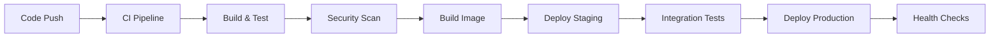

# Deployment Guide

## Overview

This guide provides comprehensive deployment documentation for the AI Content Curator Agent, covering local development, staging, and production deployments across multiple cloud platforms. The project supports modern DevOps practices with automated CI/CD pipelines, containerization, and multi-cloud deployment strategies.

## Table of Contents

- [Deployment Architecture](#deployment-architecture)
- [Prerequisites](#prerequisites)
- [Environment Configuration](#environment-configuration)
- [CI/CD Pipeline](#cicd-pipeline)
- [Local Development](#local-development)
- [Cloud Deployment Options](#cloud-deployment-options)
- [Monitoring & Observability](#monitoring--observability)
- [Security](#security)
- [Troubleshooting](#troubleshooting)
- [Best Practices](#best-practices)

## Deployment Architecture

### High-Level Architecture

```
┌─────────────────┐    ┌─────────────────┐    ┌─────────────────┐
│   Development   │───▶│     Staging     │───▶│   Production    │
│   Environment   │    │   Environment   │    │   Environment   │
└─────────────────┘    └─────────────────┘    └─────────────────┘
         │                       │                       │
         ▼                       ▼                       ▼
┌─────────────────┐    ┌─────────────────┐    ┌─────────────────┐
│ Docker Compose  │    │ Kubernetes/ECS  │    │ Kubernetes/ECS  │
│   Local Dev     │    │ Auto-deployment │    │ Manual Release  │
└─────────────────┘    └─────────────────┘    └─────────────────┘
```

### Deployment Options

| Platform | Technology | Use Case | Scalability | Complexity |
|----------|------------|----------|-------------|------------|
| **Local Development** | Docker Compose | Development/Testing | Limited | Low |
| **AWS EKS** | Kubernetes | Production | High | Medium |
| **AWS ECS** | Docker/Fargate | Production | High | Low |
| **Azure AKS** | Kubernetes | Production | High | Medium |
| **Azure ACI** | Container Instances | Development/Small Scale | Medium | Low |

## Prerequisites

### System Requirements

#### Local Development
- **Node.js**: >= 18.0.0 (LTS recommended)
- **Docker**: >= 20.10.0
- **Docker Compose**: >= 2.0.0
- **Git**: >= 2.20.0
- **Redis**: >= 6.0.0 (can use Docker)

#### Cloud Deployment

**AWS Requirements:**
- AWS CLI >= 2.0.0
- kubectl >= 1.24.0
- eksctl >= 0.100.0 (for EKS)
- Helm >= 3.8.0 (for EKS)
- Valid AWS credentials with appropriate permissions

**Azure Requirements:**
- Azure CLI >= 2.40.0
- kubectl >= 1.24.0
- Helm >= 3.8.0 (for AKS)
- Valid Azure subscription and credentials

### Installation Scripts

Quick setup for different platforms:

```bash
# Install prerequisites (macOS)
./deployment/scripts/setup-macos.sh

# Install prerequisites (Ubuntu)
./deployment/scripts/setup-ubuntu.sh

# Verify installation
./deployment/scripts/verify-setup.sh
```

## Environment Configuration

### Environment Variables

| Variable | Development | Staging | Production | Description |
|----------|-------------|---------|------------|-------------|
| `NODE_ENV` | `development` | `staging` | `production` | Environment identifier |
| `PORT` | `3000` | `3000` | `3000` | Application port |
| `LOG_LEVEL` | `debug` | `info` | `warn` | Logging verbosity |
| `REDIS_HOST` | `localhost` | Redis endpoint | Redis endpoint | Cache server |
| `REDIS_PORT` | `6379` | `6379` | `6380` (SSL) | Cache port |
| `DB_HOST` | `localhost` | DB endpoint | DB endpoint | Database server |
| `DB_NAME` | `ai_curator_dev` | `ai_curator_staging` | `ai_curator_prod` | Database name |

### Configuration Files

**Development (`.env.development`)**:
```bash
NODE_ENV=development
PORT=3000
LOG_LEVEL=debug
REDIS_HOST=localhost
REDIS_PORT=6379
DB_HOST=localhost
DB_PORT=5432
DB_NAME=ai_curator_dev
ENABLE_DEBUG_LOGGING=true
```

**Staging (`.env.staging`)**:
```bash
NODE_ENV=staging
PORT=3000
LOG_LEVEL=info
REDIS_HOST=staging-redis.internal
REDIS_PORT=6379
DB_HOST=staging-db.internal
DB_NAME=ai_curator_staging
RATE_LIMIT_ENABLED=true
```

**Production (`.env.production`)**:
```bash
NODE_ENV=production
PORT=3000
LOG_LEVEL=warn
REDIS_HOST=prod-redis-cluster.internal
REDIS_PORT=6380
REDIS_TLS=true
DB_HOST=prod-db-cluster.internal
DB_NAME=ai_curator_prod
SECURITY_HEADERS=true
RATE_LIMIT_STRICT=true
```

### Secrets Management

#### AWS Secrets Manager
```bash
# Store production secrets
aws secretsmanager create-secret \
    --name "ai-content-curator/production" \
    --description "Production secrets for AI Content Curator" \
    --secret-string '{
        "DB_PASSWORD": "secure-password",
        "REDIS_PASSWORD": "redis-password",
        "JWT_SECRET": "jwt-secret-key",
        "API_KEYS": {
            "ANTHROPIC": "anthropic-api-key",
            "OPENAI": "openai-api-key",
            "PINECONE": "pinecone-api-key"
        }
    }'
```

#### Azure Key Vault
```bash
# Store production secrets
az keyvault secret set --vault-name "ai-content-curator-kv" --name "db-password" --value "secure-password"
az keyvault secret set --vault-name "ai-content-curator-kv" --name "redis-password" --value "redis-password"
az keyvault secret set --vault-name "ai-content-curator-kv" --name "jwt-secret" --value "jwt-secret-key"
```

## CI/CD Pipeline

### GitHub Actions Workflow

The project implements a comprehensive CI/CD pipeline with multiple stages:



### Pipeline Stages

#### 1. Continuous Integration (`ci.yml`)
```yaml
# Triggers: Push to main/develop, Pull Requests
Stages:
  - Code Quality:
    - ESLint checking
    - TypeScript compilation
    - Prettier formatting
  - Testing:
    - Unit tests (Node 18.x & 20.x)
    - Integration tests
    - Coverage reporting
  - Security:
    - CodeQL analysis
    - Dependency vulnerability scan
  - Build Validation:
    - Docker image build
    - Multi-architecture support
```

#### 2. Continuous Deployment (`cd.yml`)
```yaml
# Triggers: Main branch push, Tagged releases
Stages:
  - Build & Publish:
    - Multi-arch Docker build
    - Push to GitHub Container Registry
    - Generate SBOM
  - Deploy Staging:
    - Auto-deploy from main branch
    - Smoke tests
    - Environment validation
  - Deploy Production:
    - Manual approval for tagged releases
    - Blue-green deployment
    - Rollback capability
```

#### 3. Dependency Management (`dependencies.yml`)
```yaml
# Triggers: Weekly schedule, Manual trigger
Stages:
  - Dependency Updates:
    - Automated security updates
    - Compatibility testing
    - Pull request creation
  - Security Auditing:
    - High/critical vulnerability detection
    - Automated issue creation
    - Notification system
```

### Pipeline Configuration

**Branch Protection Rules:**
- Require pull request reviews
- Require status checks to pass
- Restrict pushes to main branch
- Require branches to be up to date

**Deployment Environments:**
- **Staging**: Auto-deploy from main branch
- **Production**: Manual approval for releases
- **Review Apps**: Temporary environments for PRs

## Local Development

### Docker Compose Setup

#### Quick Start
```bash
# Start core services
docker-compose up -d

# Start with monitoring
docker-compose --profile monitoring up -d

# Start everything
docker-compose --profile monitoring --profile tools up -d
```

#### Available Profiles

**Core Services** (default):
- Application (Node.js)
- PostgreSQL database
- Redis cache

**Tools Profile** (`--profile tools`):
- pgAdmin (PostgreSQL UI)
- Redis Commander (Redis UI)

**Monitoring Profile** (`--profile monitoring`):
- Prometheus (metrics collection)
- Grafana (dashboards)
- Node Exporter (system metrics)
- Database/Redis exporters

#### Development Workflow

```bash
# 1. Start dependencies
docker-compose up -d postgres redis

# 2. Install dependencies
npm install

# 3. Start development server
npm run dev

# 4. Run tests
npm test

# 5. Check health
curl http://localhost:3000/health
```

### Local Environment Commands

```bash
# Database operations
npm run db:migrate        # Run migrations
npm run db:seed          # Seed test data
npm run db:reset         # Reset database

# Development utilities
npm run dev              # Start with hot reload
npm run debug            # Start with debugger
npm run build            # Build for production
npm run start            # Start production build

# Quality checks
npm run lint             # Run ESLint
npm run test:watch       # Run tests in watch mode
npm run type-check       # TypeScript validation
```

## Cloud Deployment Options

### Unified Deployment Interface

Use the unified deployment script for all cloud platforms:

```bash
# Interactive mode
./deployment/deploy.sh

# Command line mode
./deployment/deploy.sh aws-eks        # Deploy to AWS EKS
./deployment/deploy.sh aws-ecs        # Deploy to AWS ECS
./deployment/deploy.sh azure-aks      # Deploy to Azure AKS
./deployment/deploy.sh azure-aci      # Deploy to Azure ACI
```

### AWS Deployment

#### EKS (Kubernetes) Deployment

**Features:**
- Auto-scaling cluster (2-5 nodes)
- Application Load Balancer with SSL
- AWS Load Balancer Controller
- Horizontal Pod Autoscaling
- CloudWatch monitoring

**Deployment Process:**
```bash
# Set environment variables
export AWS_REGION="us-west-2"
export CLUSTER_NAME="ai-content-curator"
export ENVIRONMENT="production"
export IMAGE_TAG="v1.0.0"

# Deploy to EKS
./deployment/aws/scripts/deploy-eks.sh

# Check deployment status
./deployment/aws/scripts/deploy-eks.sh status

# Cleanup (careful!)
./deployment/aws/scripts/deploy-eks.sh cleanup
```

**Architecture:**
```
┌─────────────────┐    ┌─────────────────┐    ┌─────────────────┐
│ Application     │───▶│      EKS        │───▶│      ECR        │
│ Load Balancer   │    │   Cluster       │    │   Registry      │
└─────────────────┘    └─────────────────┘    └─────────────────┘
         │                       │                       │
         ▼                       ▼                       ▼
┌─────────────────┐    ┌─────────────────┐    ┌─────────────────┐
│     Route53     │    │   Auto Scaling  │    │   CloudWatch    │
│   DNS/SSL       │    │   Groups        │    │   Monitoring    │
└─────────────────┘    └─────────────────┘    └─────────────────┘
```

#### ECS (Fargate) Deployment

**Features:**
- Serverless containers
- Application Load Balancer
- Auto-scaling based on CPU/memory
- VPC with public/private subnets
- CloudWatch logging

**Deployment Process:**
```bash
# Set environment variables
export AWS_REGION="us-west-2"
export ENVIRONMENT="production"

# Deploy to ECS
./deployment/aws/scripts/deploy-ecs.sh

# Check status
./deployment/aws/scripts/deploy-ecs.sh status
```

### Azure Deployment

#### AKS (Kubernetes) Deployment

**Features:**
- Managed Kubernetes service
- NGINX Ingress Controller
- cert-manager for SSL certificates
- Cluster autoscaler
- Azure Monitor integration

**Deployment Process:**
```bash
# Set environment variables
export AZURE_LOCATION="eastus"
export CLUSTER_NAME="ai-content-curator"
export ENVIRONMENT="production"

# Deploy to AKS
./deployment/azure/scripts/deploy-aks.sh

# Scale application
./deployment/azure/scripts/deploy-aks.sh scale 5

# Check status
./deployment/azure/scripts/deploy-aks.sh status
```

#### ACI (Container Instances) Deployment

**Features:**
- Serverless containers
- Azure Database for PostgreSQL
- Azure Cache for Redis
- Persistent storage with Azure Files
- Log Analytics workspace

**Deployment Process:**
```bash
# Set environment variables
export AZURE_LOCATION="eastus"
export ENVIRONMENT="production"

# Deploy to ACI
./deployment/azure/scripts/deploy-aci.sh

# View logs
./deployment/azure/scripts/deploy-aci.sh logs

# Restart containers
./deployment/azure/scripts/deploy-aci.sh restart
```

### Kubernetes Configuration

#### Base Configuration (`k8s/base/`)

**Core Resources:**
- Namespace isolation
- ConfigMap for configuration
- Secret for sensitive data
- Deployment with rolling updates
- Service for load balancing
- Ingress for external access
- HPA for auto-scaling
- PDB for availability
- NetworkPolicy for security

#### Environment Overlays

**Development** (`k8s/overlays/development/`):
- Resource limits: Reduced
- Replica count: 1-2 pods
- Debug settings: Enabled
- Storage: EmptyDir volumes

**Staging** (`k8s/overlays/staging/`):
- Resource limits: Production-like
- Replica count: 2-3 pods
- SSL: Let's Encrypt certificates
- Autoscaling: 2-5 replicas

**Production** (`k8s/overlays/production/`):
- Resource limits: Optimized
- Replica count: 3-20 pods (HPA)
- High availability: Multi-zone
- Security: Network policies, RBAC
- Monitoring: Full observability

## Monitoring & Observability

### Monitoring Stack

#### Grafana Dashboards

Four comprehensive dashboards are included:

1. **Overview Dashboard**: Real-time application monitoring
   - HTTP request metrics and response times
   - Error rates and status codes
   - System resource usage
   - Active request tracking

2. **Business Metrics Dashboard**: AI/ML operations monitoring
   - Content discovery rates
   - ML tagging performance and accuracy
   - Vector database operations
   - External API response times

3. **Infrastructure Dashboard**: System health monitoring
   - PostgreSQL performance metrics
   - Redis cache performance
   - System resources (CPU, memory, disk, network)
   - Service availability tracking

4. **Alerts Dashboard**: Incident response
   - Critical alert conditions
   - Error event timelines
   - Response time heatmaps
   - Top slowest endpoints

#### Metrics Collection

**Application Metrics:**
```javascript
// Custom metrics exposed at /metrics
ai_curator_content_discovered_total
ai_curator_tags_generated_total
ai_curator_vector_operations_total
ai_curator_cache_hit_rate
ai_curator_system_health
```

**Infrastructure Metrics:**
- Node Exporter: System metrics
- PostgreSQL Exporter: Database metrics
- Redis Exporter: Cache metrics

#### Health Monitoring

**Health Endpoints:**
- `/health`: Basic health check
- `/health/detailed`: Comprehensive health status

**Health Checks:**
- Redis connectivity and latency
- Memory usage monitoring
- System resource availability
- External service dependencies

### Logging Strategy

**Structured Logging:**
```typescript
logger.info('Content processed', {
  contentId,
  processingTime,
  tags: assignedTags,
  userId,
  timestamp: new Date().toISOString(),
  correlationId: req.requestId,
});
```

**Log Aggregation:**
- AWS: CloudWatch Logs
- Azure: Log Analytics
- Kubernetes: Centralized logging with Fluentd

## Security

### Security Measures

#### Container Security
- Non-root user execution
- Minimal base images (Alpine Linux)
- Regular vulnerability scanning
- Dependency security audits
- Multi-stage builds for smaller attack surface

#### Network Security
```yaml
# Network policies for Kubernetes
apiVersion: networking.k8s.io/v1
kind: NetworkPolicy
metadata:
  name: ai-curator-network-policy
spec:
  podSelector:
    matchLabels:
      app: ai-news-curator
  policyTypes:
  - Ingress
  - Egress
  ingress:
  - from:
    - podSelector:
        matchLabels:
          app: nginx-ingress
  egress:
  - to:
    - podSelector:
        matchLabels:
          app: redis
  - to:
    - podSelector:
        matchLabels:
          app: postgres
```

#### Security Headers
```typescript
app.use(helmet({
  contentSecurityPolicy: {
    directives: {
      defaultSrc: ["'self'"],
      styleSrc: ["'self'", "'unsafe-inline'"],
      scriptSrc: ["'self'"],
      imgSrc: ["'self'", 'data:', 'https:'],
    },
  },
  hsts: {
    maxAge: 31536000,
    includeSubDomains: true,
    preload: true,
  },
}));
```

#### Secrets Management
- AWS: Secrets Manager + IAM roles
- Azure: Key Vault + Managed Identity
- Kubernetes: Secret resources with encryption at rest
- Never store secrets in code or environment files

### Security Scanning

**Automated Security Checks:**
- CodeQL static analysis
- Dependency vulnerability scanning
- Container image scanning
- Infrastructure as Code security

## Troubleshooting

### Common Issues

#### Container Issues
```bash
# Check container logs
docker logs <container-id>

# Debug running container
docker exec -it <container-id> /bin/sh

# Restart services
docker-compose restart app
```

#### Kubernetes Issues
```bash
# Check pod status
kubectl get pods -n ai-news-curator-prod

# View pod logs
kubectl logs -l app=ai-news-curator -n ai-news-curator-prod --tail=100

# Debug pod
kubectl exec -it <pod-name> -n ai-news-curator-prod -- /bin/sh

# Check events
kubectl get events -n ai-news-curator-prod --sort-by='.lastTimestamp'
```

#### Cloud-Specific Issues

**AWS:**
```bash
# Check EKS cluster status
aws eks describe-cluster --name ai-content-curator

# View CloudWatch logs
aws logs describe-log-groups --log-group-name-prefix /aws/eks/

# Check ECS task status
aws ecs describe-services --cluster ai-content-curator --services ai-content-curator-service
```

**Azure:**
```bash
# Check AKS cluster status
az aks show --name ai-content-curator --resource-group ai-content-curator-rg

# View container logs
az container logs --resource-group ai-content-curator-rg --name ai-content-curator-cg

# Check resource status
az resource list --resource-group ai-content-curator-rg --output table
```

### Debugging Commands

```bash
# Application debugging
npm run debug              # Start with debugger attached
curl http://localhost:3000/health | jq  # Check health status

# Database debugging
docker-compose exec postgres psql -U postgres -d ai_news_curator
docker-compose exec redis redis-cli

# Network debugging
nslookup service-name.namespace.svc.cluster.local
kubectl port-forward svc/ai-news-curator-service 8080:80

# Performance debugging
top -p $(pgrep -f "node")
docker stats
kubectl top pods -n ai-news-curator-prod
```

## Best Practices

### Deployment Best Practices

1. **Infrastructure as Code**
   - Version control all configuration
   - Use declarative configurations
   - Implement automated testing
   - Document deployment procedures

2. **Security First**
   - Never store secrets in code
   - Use least privilege access
   - Implement defense in depth
   - Regular security audits

3. **Monitoring & Observability**
   - Implement comprehensive logging
   - Monitor business and technical metrics
   - Set up alerting for critical issues
   - Use distributed tracing

4. **Reliability & Resilience**
   - Implement health checks
   - Use circuit breakers
   - Plan for disaster recovery
   - Test failure scenarios

### Performance Optimization

1. **Resource Management**
   ```yaml
   # Kubernetes resource limits
   resources:
     requests:
       memory: "256Mi"
       cpu: "250m"
     limits:
       memory: "512Mi"
       cpu: "500m"
   ```

2. **Caching Strategy**
   - Redis for application caching
   - CDN for static assets
   - Database query optimization
   - HTTP response caching

3. **Auto-scaling Configuration**
   ```yaml
   # HPA configuration
   spec:
     minReplicas: 3
     maxReplicas: 20
     metrics:
     - type: Resource
       resource:
         name: cpu
         target:
           type: Utilization
           averageUtilization: 70
   ```

### Cost Optimization

1. **Resource Right-sizing**
   - Monitor resource utilization
   - Adjust based on actual usage
   - Use burstable instances for variable workloads

2. **Auto-scaling Policies**
   - Scale down during low usage periods
   - Use spot instances for non-critical workloads
   - Implement efficient resource scheduling

3. **Multi-cloud Strategy**
   - Compare pricing across providers
   - Use reserved instances for predictable workloads
   - Optimize data transfer costs

### Maintenance & Updates

1. **Rolling Updates**
   ```bash
   # Zero-downtime deployment
   kubectl set image deployment/ai-news-curator ai-news-curator=new-image:tag
   kubectl rollout status deployment/ai-news-curator
   ```

2. **Backup Strategies**
   - Automated database backups
   - Configuration backup and versioning
   - Disaster recovery procedures

3. **Dependency Management**
   - Regular dependency updates
   - Security patch management
   - Compatibility testing

This deployment guide provides a comprehensive overview of deploying the AI Content Curator Agent across multiple environments and cloud platforms, ensuring reliable, secure, and scalable deployments. 